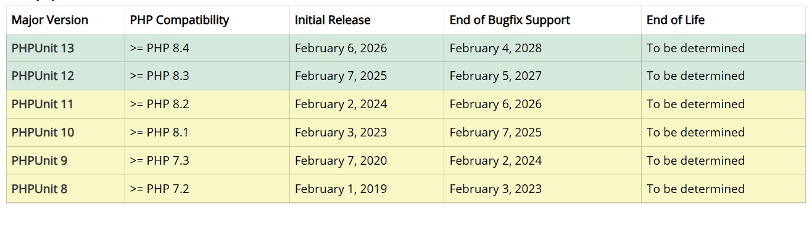

# verificaUnitTest
repo UNIT TEST php

## Contiene il manuale locale della versione 11 di unittest


Come si evince è necessario avere php 8.2 o superiore

## Avviare phpUnit

```bash
php phpunit.phar BankAccountTest.php
```

